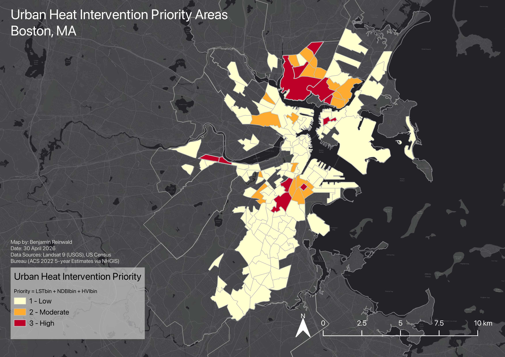
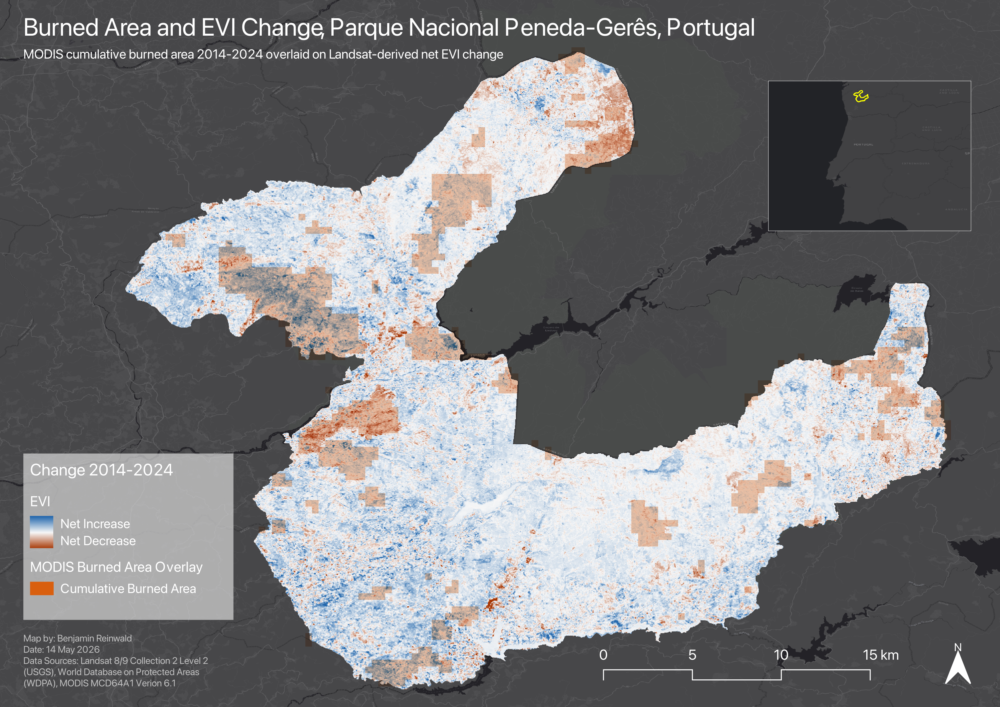

---
# About
Environmental science graduate focused on geospatial analysis, remote sensing, and environmental research. Strong interests in water and wastewater systems, stormwater infrastructure, green infrastructure, and clean power. Experienced with GIS and remote sensing workflows using QGIS, ArcGIS Pro, and Google Earth Engine. Seeking GIS analyst, GIS technician, environmental consultant, surveyor, or related roles.

---

## Projects

<h3><a href="./uhi-boston.html">Urban Heat Island Equity Analysis - Boston Metropolitan Area</a></h3>

Statistical and spatial analysis of urban heat patterns and social vulnerability across Boston using Landsat 9 imagery and census tract data.

<strong>Methods & Tools:</strong> 
QGIS • Google Sheets • Remote Sensing • Spatial Analysis • Landsat 9 • ACS Census Data

  

<h3><a href="./peneda-geres-vegetation-change.html">Vegetation Change and Burned Area Patterns - Peneda-Gerês National Park</a></h3>

Remote sensing analysis of vegetation change and wildfire disturbance in Portugal’s only national park using Landsat 8/9 EVI composites and MODIS burned area data.

<strong>Methods & Tools:</strong> 
Google Earth Engine • QGIS • Remote Sensing • Landsat 8/9 • MODIS Burned Area • Vegetation Change Detection

  

---

## Links

- [LinkedIn](https://linkedin.com/in/benjaminreinwald)
- [Resume](./resume.pdf)

