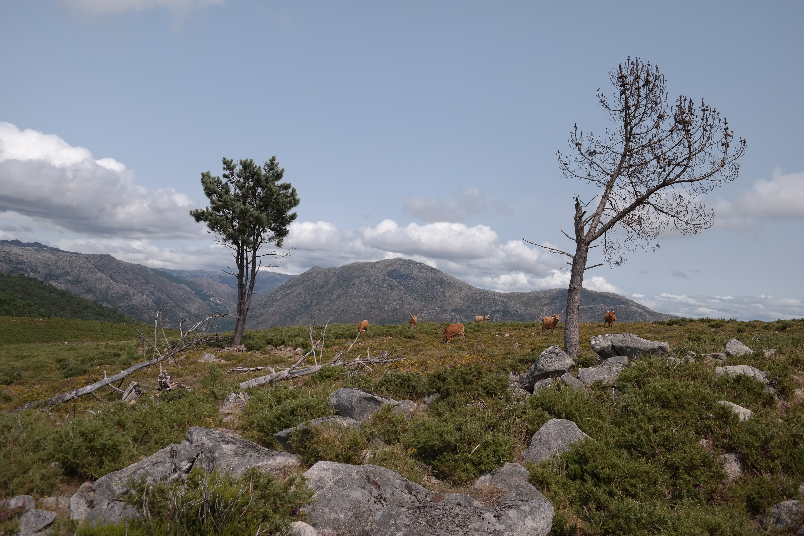
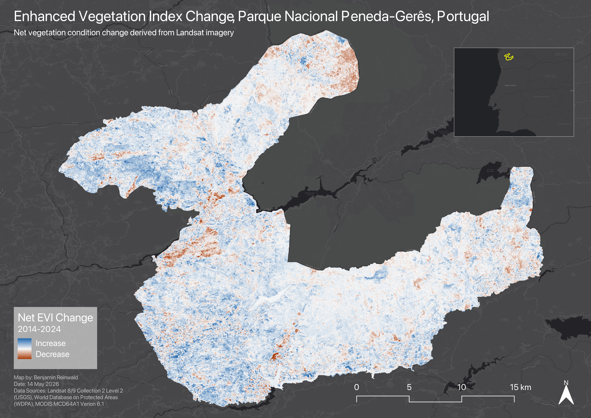
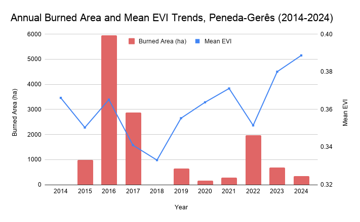
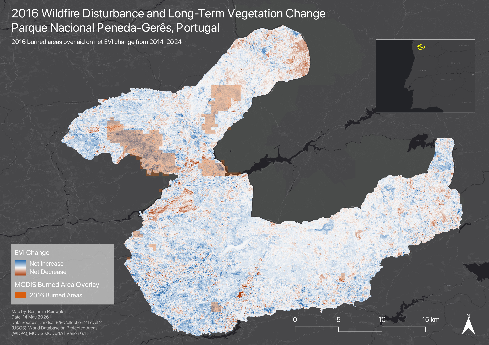

Photo taken in Parque Nacional Peneda-Gerês, Portugal. My family is from a village located within the park, giving this project a personal connection to the study area.

This project examines vegetation condition change in the Peneda-Gerês National Park, Portugal over a ten-year period from 2014 to 2024 using multi-temporal satellite images and remote sensing analysis. Vegetation change patterns were compared with cumulative burned area to study long-term disturbance and recovery patterns within the park.

Parque Nacional Peneda-Gerês is Portugal’s only national park and its drought-tolerant landscape is characterized by forests, shrublands, and mountainous terrain. The park experiences seasonal wildfire activity characteristic of Mediterranean ecosystems and comparable to the chaparral biome found in regions such as Southern California. The project was conducted using Google Earth Engine for analysis and QGIS for cartographic outputs.

Datasets: Landsat 8/9 (Collection 2 Level-2), MODIS Burned Area Product (MCD64A1 Version 6.1), and World Database on Protected Areas (WDPA).

## Workflow

- Used Google Earth Engine to calculate Enhanced Vegetation Index (EVI) from Landsat 8/9 imagery.
- Masked clouds, cloud shadow, snow, and cirrus pixels using the Landsat QA_PIXEL band.
- Created early-period and late-period growing season mean EVI composites for 2014–2016 and 2022–2024.
- Calculated net EVI change by subtracting early-period mean EVI from late-period mean EVI.
- Used MODIS burned area data to map cumulative wildfire disturbance from 2014–2024.
- Compared annual burned area trends with annual mean growing-season EVI.

## Visualizations

  
  
<strong>Figure 1.</strong> Net Enhanced Vegetation Index (EVI) change across Peneda-Gerês National Park between 2014 and 2024. Blue areas indicate long-term increases in vegetation condition and orange areas indicate long-term decreases. Most of the park shows relatively stable or improving vegetation condition over the study period.

  
  
<strong>Figure 2.</strong> Cumulative MODIS burned area detections from 2014–2024 overlaid on Landsat-derived net EVI change during the study period. Burned areas frequently overlap with areas of both vegetation condition increases and decline; however, burned areas do not commonly overlap with areas of no significant change in vegeation condition.

  
  
<strong>Figure 3.</strong> Annual burned area in hectares and mean EVI trends for Peneda-Gerês National Park from 2014-2024. Burned area peaked in 2016 and 2017, followed by a decrease in mean EVI until 2018. Mean EVI generally increased following these significant wildfire events before experiencing another decline and subsequent rebound following another major wildfire year in 2022. 

  
  
<strong>Figure 4.</strong> Burned areas from the major 2016 wildfire season overlaid on cumulative EVI change from 2014-2024. Many areas affected by the 2016 wildfire show long-term increases in EVI, suggesting substantial vegetation recovery following the disturbance in this fire-adapted ecosystem. The early timing of the wildfire within the study period likely explains the observed vegetation recovery. 

## Key Findings
- Mean EVI increased slightly (~0.013) between the early and late study periods, indicating generally stable or improving vegetation condition in the park.
- Approximately 13,370 hectares of cumulative burned areas were mapped. Burned areas were associated with short-term vegetation decline and long-term vegetation recovery.
- The major 2016 wildfire year did not produce an immediate park-wide decrease in growing season mean EVI, possibly because many fires occurred late in the growing season.
- Following the 2016 wildfire disturbance, mean EVI declined until 2018 before increasing through 2022, when another significant burned area year occurred. Additionally, many areas affected by the 2016 wildfires show long-term increases in EVI by 2024, suggesting substantial post-fire regrowth and recovery.

## Full Report

[Download Full Report](./Peneda_Geres_Vegetation_Change.pdf)
