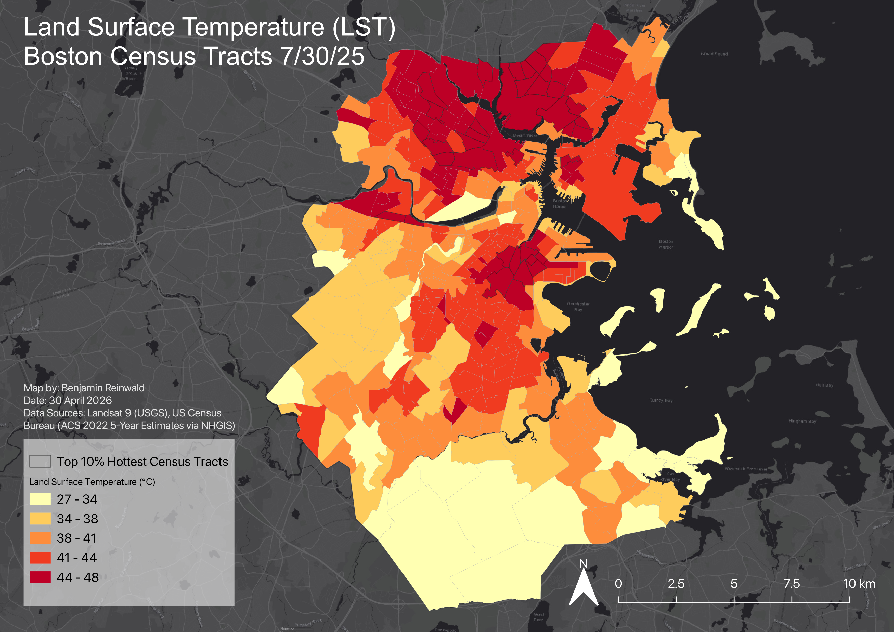
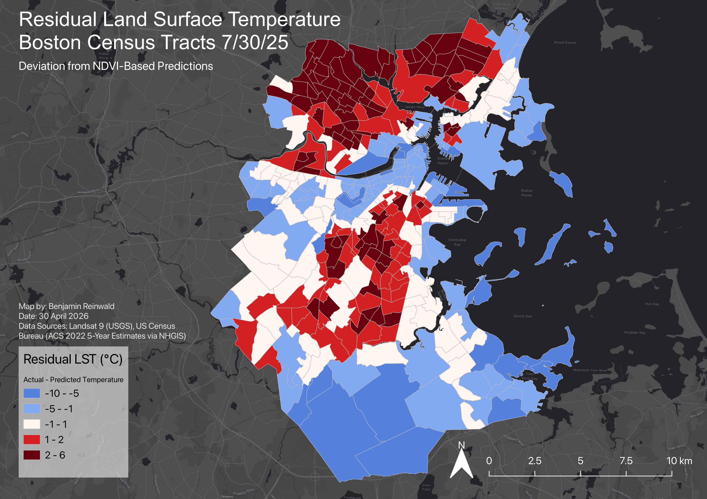
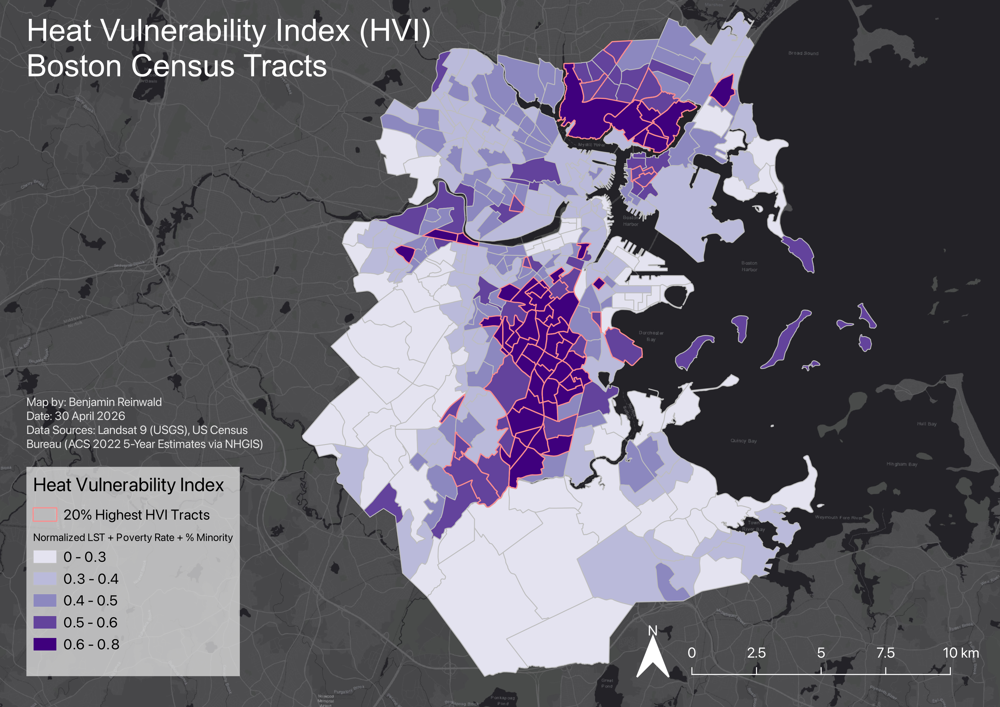

# Urban Heat Island Equity Analysis - Boston, MA

## Study Area and Data
This study examines urban heat island patterns across Boston, Massachusetts and adjacent municipalities using census tracts as the unit of analysis. The aerial imagery used in the study was collected on July 30, 2025, which was selected based on minimal cloud cover and high air temperatures (~86°F), to provide reliable land surface temperature data and to capture peak urban heat island conditions.

Datasets: Landsat 9 (Collection 2 Level-2), 2020 Census Tracts (MassGIS), 2022 American Community Survey 5-year estimates; accessed via NHGIS (IPUMS).

Figure 1. Land surface temperatures are highest in Roxbury, South Boston, Allston, Cambridge, Somerville, Everett, Medford, Chelsea, and East Boston. The regression model (y=-34.2x+46.8) indicated an inverse relationship between NDVI and land surface temperature, and was used to create the residual LST map. 

### Residual LST (Observed vs Expected)

Several neighborhoods in northern Boston and parts of Roxbury, Dorchester, and South Boston exhibit positive residuals, indicating factors beyond vegetation, such as building density and impervious surfaces, are contributing to higher temperatures. Coastal areas exhibit negative residuals likely due to cooling effects of the Atlantic Ocean and the Charles River.

### Heat Vulnerability Index (HVI)

Census tracts in Roxbury, the South End, South Boston, Dorchester, Allston, Medford, Everett, Revere, and Chelsea contain the highest HVI values. These are locations where both environmental (LST) and social (percent minority and poverty rate) risk factors are present.

### Priority Heat Intervention Areas

Priority heat intervention areas were identified by combining binary values for the top 10% highest LST, 25% highest NDBI, and 20% highest HVI tracts. A priority score was calculated as the sum of these values. The highest priority areas are in South Boston, the South End, Roxbury, Allston, Chelsea, Everett, Medford, and East Boston.

## Key Findings
- Built environment is the primary driver of urban heat
- Vegetation is strongly associated with lower surface temperatures
- Socially vulnerable populations are disproportionately exposed to high temperatures
- Priority heat intervention areas identified across Boston and adjacent municipalities

## Methods
- Landsat 9 used to derive LST, NDVI, and NDBI
- Demographic data agreggated to Census tract-level using zonal statistics
- Correlation and regression analysis
- Heat Vulnerability Index created by normalizing and averaging LST, percent minority, and poverty rate variables

## Full Report
[Download Full Report](./UHI_Analysis.pdf)
