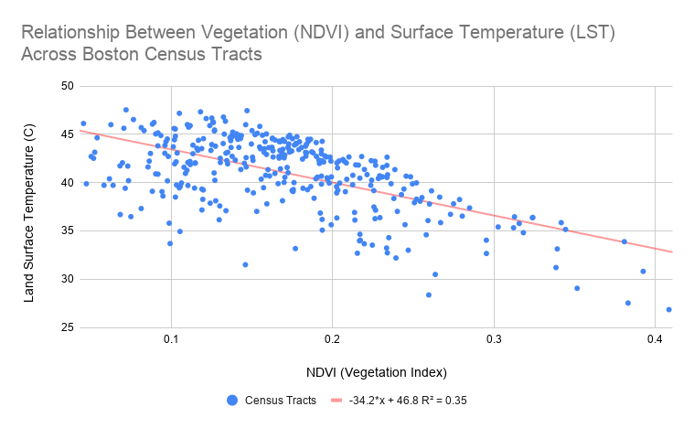
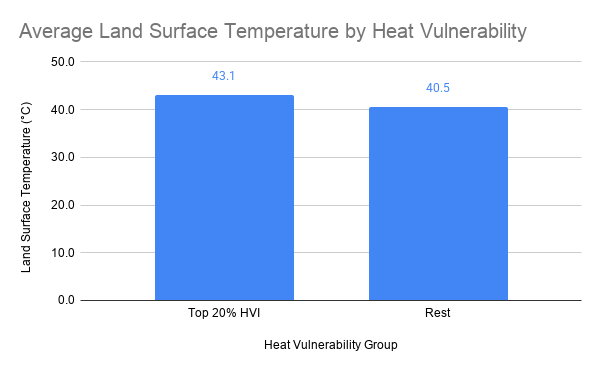
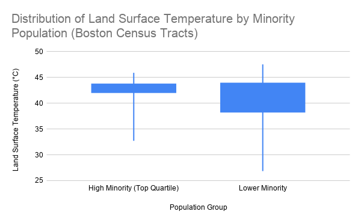

This study examines urban heat island patterns across Boston, Massachusetts and adjacent municipalities using census tracts as the unit of analysis. The satellite imagery used in the study was collected on July 30, 2025, which was selected because of minimal cloud cover and high air temperatures (~86°F) to provide reliable land surface temperature (LST) data and to capture peak urban heat island conditions.

<strong>Study Area</strong>
Boston, Massachusetts and adjacent municipalities

<strong>Data Sources</strong>
Landsat 9, ACS 5-Year Estimates, MassGIS Census Tracts

<strong>Methods</strong>
Remote Sensing, Spatial Analysis, Regression Analysis

<strong>Software</strong>
QGIS, ArcGIS Pro

Datasets: Landsat 9 (Collection 2 Level-2), 2020 Census Tracts (MassGIS), 2022 American Community Survey (ACS) 5-year estimates; accessed via NHGIS (IPUMS).

## Workflow
- Landsat 9 used to derive LST, vegetation (NDVI), & built-up (NDBI) indices. Data aggregated to census tract level using zonal statistics.
- Percent minority & poverty rate derived from ACS data and joined to census tract geometries.
- Correlation & regression analysis on LST vs. independent variables: NDVI, NDBI, median income, percent minority, & poverty rate.
- Residual LST calculated as the difference between observed & predicted LST based on the regression model between LST & NDVI.
- Heat Vulnerability Index (HVI) created by normalizing and averaging LST, percent minority, & poverty rate variables.
- Urban heat intervention priority areas identified by summing binary values for the top 10% highest LST, 25% highest NDBI, & 20% highest HVI tracts.

## Visualizations

## Visualizations

  

    <h3>Land Surface Temperature</h3>
    
<strong>Figure 1.</strong> LST is highest in Roxbury, South Boston, Allston, Cambridge, Somerville, Everett, Medford, Chelsea, and East Boston.

  

  

    
  

  

    <h3>Vegetation and Heat</h3>
    
<strong>Figure 2.</strong> The regression model shows an inverse relationship between vegetation cover and LST. A 0.1 increase in NDVI corresponds to an approximate 3.4°C decrease in LST.

  

  

    
  

  
  
<strong>Figure 3.</strong> Several neighborhoods in northern Boston and parts of Roxbury, Dorchester, and South Boston exhibit positive residuals, indicating factors beyond vegetation, such as building density and impervious surfaces, are contributing to higher LST. Coastal areas exhibit negative residuals likely due to cooling effects of the Atlantic Ocean and the Charles River.

  
  
<strong>Figure 4.</strong> Census tracts in Roxbury, the South End, South Boston, Dorchester, Allston, Medford, Everett, Revere, and Chelsea contain the highest HVI values. These are locations where both environmental risk and social vulnerability factors are present.

  
  
<strong>Figure 5.</strong> Census tracts in the top 20% of the HVI experience average LST approximately 2.6°C higher than the rest of the study area.

  
  
<strong>Figure 6.</strong> Census tracts with a lower percentage of minority population exhibit a wider LST range, possibly reflecting the presence of both dense urban areas and more vegetated neighborhoods.

  
  
<strong>Figure 7.</strong> Urban heat intervention priority areas were identified by combining binary values for the top 10% highest LST, 25% highest NDBI, and 20% highest HVI tracts. A priority score was calculated as the sum of these values. The highest priority areas are in South Boston, the South End, Roxbury, Allston, Chelsea, Everett, Medford, and East Boston.

## Key Findings
- Built environment is the primary driver of urban heat and proximity to bodies of water has a significant cooling effect.
- Vegetation is strongly associated with lower LST, while percent minority population and poverty rate show weaker but still meaningful spatial relationships with higher LST.
- Socially vulnerable populations are located disproportionately in areas with higher exposure to extreme heat.
- Urban heat intervention priority areas were identified in South Boston, the South End, Roxbury, Allston, Chelsea, Everett, Medford, and East Boston. These areas would benefit from targeted urban cooling strategies such as green infrastructure, reflective pavements or roofing, tree planting, and water features.

## Full Report
[Download Full Report](./UHI_Analysis.pdf)
